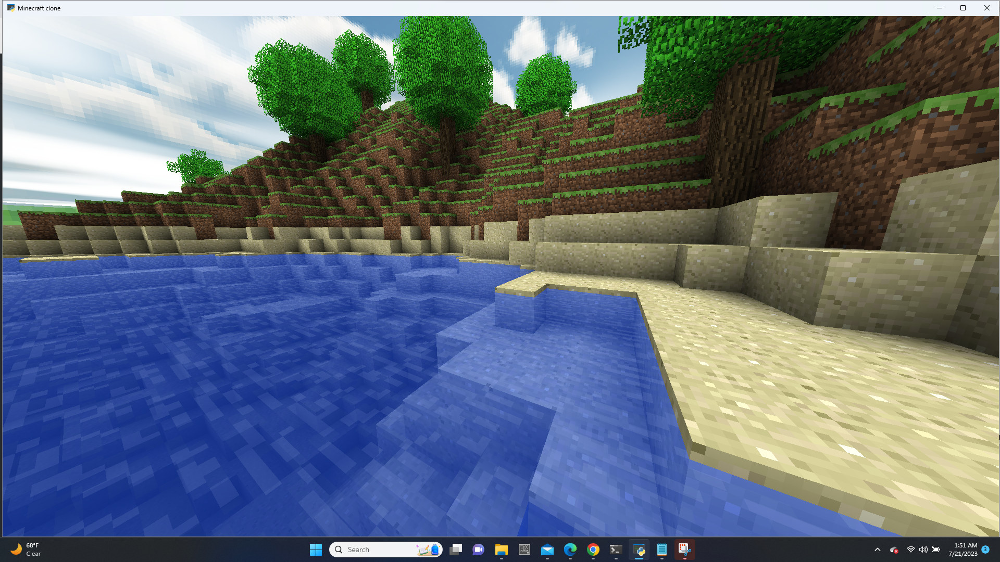

<h2>WSUCEG-7140 Class Project - minecraftclone</h2> 

Based off of https://github.com/fogleman/Craft : create moving clouds, different procedural terrain generation, generation of mazes,.

  
Members : WSUCEG7140 Erik M. Buck, bibekrj, Deekshitha-kancharla, cleancoder1016, kruslin2.  
<h2>Documentation</h2>
<ul>
  <li>cleancoder1016 - </li>
  <li>Deekshitha-kancharla - </li>
  <li>kruslin2 - <a href=" ">doc_implementing issue#98</a></li>
</ul>  

